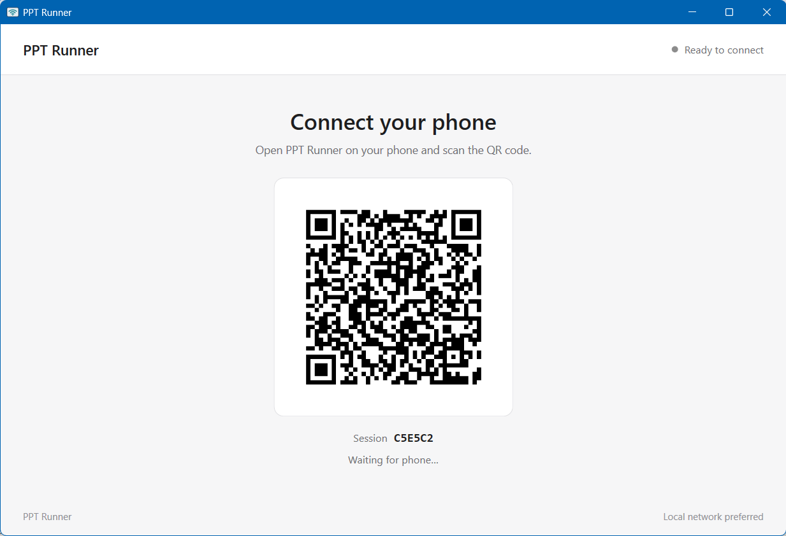
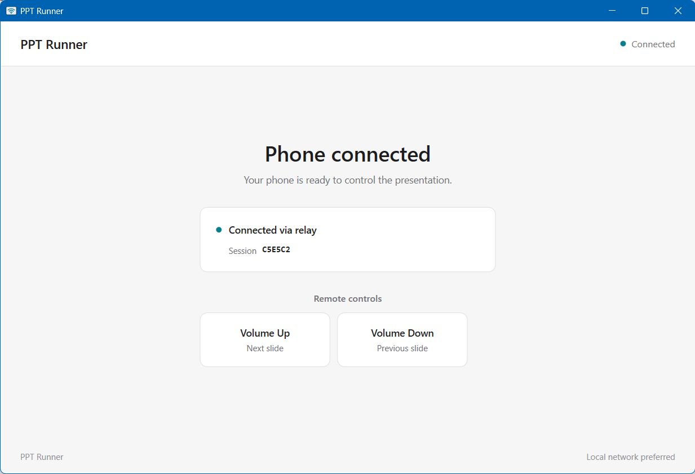
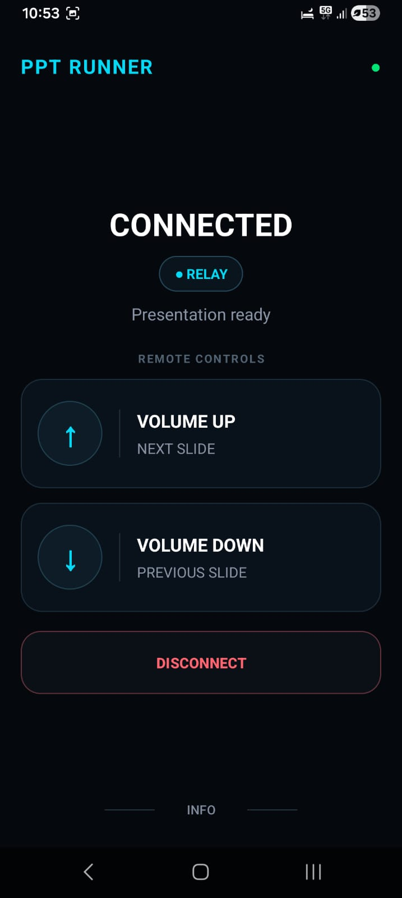
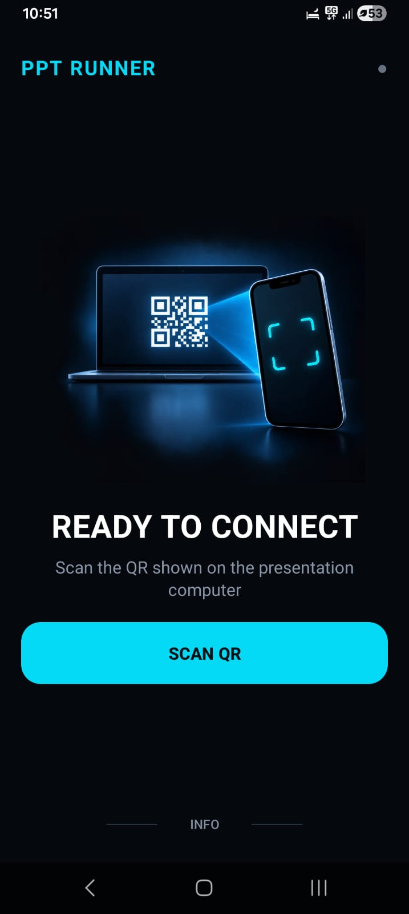
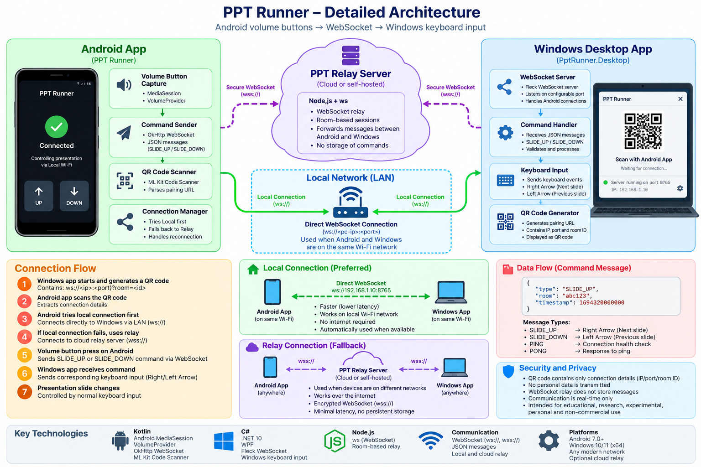
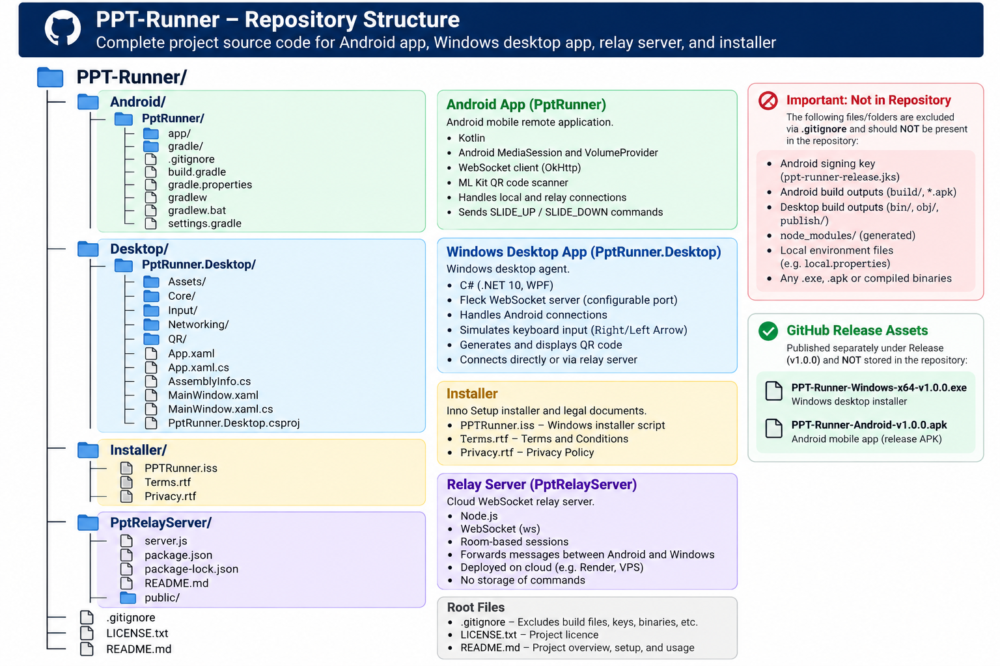
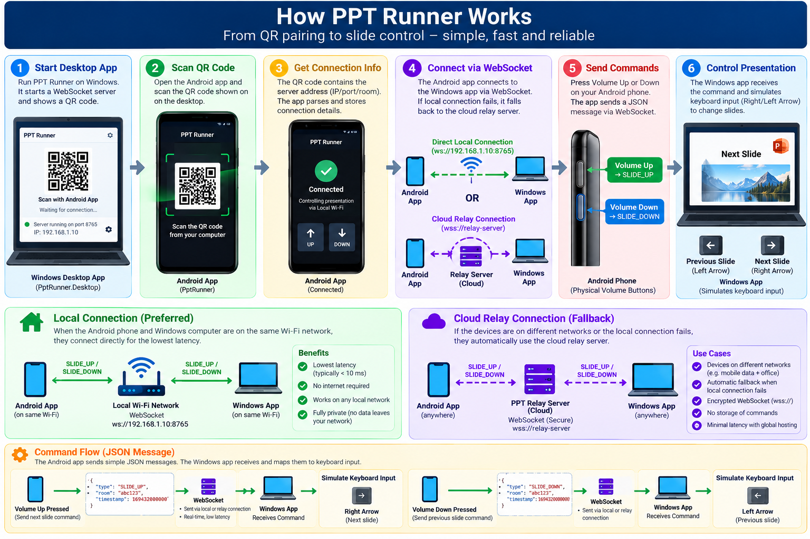

 

 

# PPT Runner

**PPT Runner** is a low-latency presentation remote system for meeting rooms, classrooms, and personal laptops.

While a presentation is running on a Windows computer, the presenter can use the **physical Volume Up / Volume Down buttons on an Android phone** to move to the next or previous slide. The phone screen does not need to stay open during the presentation.

## Download

### Latest Release

| Platform | Download |
| --- | --- |
| Windows 10/11 x64 | [**PPT-Runner-Windows-x64-v1.0.0.exe**](https://github.com/Hemantidea/PPT-Runner/releases/latest) |
| Android | [**PPT-Runner-Android-v1.0.0.apk**](https://github.com/Hemantidea/PPT-Runner/releases/latest) |

> Releases are distributed through GitHub Releases. Generated binaries are published separately as release assets rather than stored in the source tree.

---

## Screenshots

The current release includes matching Windows desktop and Android experiences for both connection and connected states.

### Windows Desktop — Ready to Connect

  

The Windows desktop agent starts a temporary session, displays the QR code, and waits for the Android controller.

### Windows Desktop — Connected

  

Once paired, the desktop shows the active transport and the available remote-control actions.

### Android — Connected

  
  

The Android controller shows the active transport and the physical Volume Up / Volume Down mappings.

### Android

  
  

The initial Android screen guides the presenter to scan the QR code displayed by the Windows application.

The Android controller shows the active transport and the physical Volume Up / Volume Down mappings.

---

## Architecture

PPT Runner uses a **local-first architecture** with a secure relay fallback.

### Detailed System Architecture

  

### Repository Structure

  

---

## How It Works

### End-to-End Flow

  

The diagram above shows the complete user flow: the Windows desktop app creates a temporary session and QR code, Android scans it, the app establishes a local WebSocket connection when possible, falls back to the secure relay when necessary, and sends slide commands from the physical volume buttons to the Windows keyboard-input layer.

### Connection flow

1. The Windows desktop app starts a new temporary session.
2. The desktop app displays a QR code containing the session information.
3. The Android app scans the QR code using ML Kit Code Scanner.
4. Android tries the **local WebSocket connection first**.
5. If local connectivity is unavailable, Android uses the **cloud relay**.
6. A physical Volume Up press sends `NEXT`.
7. A physical Volume Down press sends `PREVIOUS`.
8. The Windows desktop command gateway validates the command and invokes the keyboard input backend.
9. The presentation responds through normal keyboard controls.

---

## Key Features

### Local-first connectivity

When the phone and Windows computer are on the same network, PPT Runner prefers a direct WebSocket connection to minimise latency and avoid unnecessary cloud traffic.

### Relay fallback

When a direct local connection is unavailable, the Android app can connect through the cloud WebSocket relay.

### Physical volume-button control

The Android service uses `MediaSession` and `VolumeProvider` so the presenter can control the presentation with physical volume buttons without keeping the app screen open.

### QR pairing

The desktop application generates a QR code containing the temporary session information required by the Android application.

### Transport-state management

The desktop application tracks local and relay connectivity and exposes the active transport state in the UI.

### Duplicate/stale command protection

Commands carry sequence information so duplicate or stale packets produced during transport changes do not result in repeated slide actions.

### Minimal-data design

The MVP does not store presentation content and does not use a persistent session database.

---

## Technology Stack

| Component | Technologies |
| --- | --- |
| Android | Kotlin, Android MediaSession, VolumeProvider, OkHttp WebSocket, ML Kit Code Scanner |
| Windows | C#, .NET 10, WPF, Fleck, ClientWebSocket |
| Relay | Node.js, `ws` WebSocket library |
| Packaging | Inno Setup, self-contained `win-x64` desktop publish |
| Communication | Local WebSocket + secure WebSocket (`wss://`) relay |

---

## Security & Privacy

PPT Runner is designed around temporary sessions and minimal data handling.

- No user account is required for the MVP.
- Presentation content is not uploaded by the remote-control system.
- Relay communication uses secure WebSocket transport (`wss://`).
- Session state is temporary and is not stored in a persistent database in the MVP.
- The relay forwards commands between the connected Android and Windows endpoints.
- The project is intended for educational, research, experimental, personal, and non-commercial use according to the project licence.

See the project documents:

- [Terms of Use](Installer/Terms.rtf)
- [Privacy Notice](Installer/Privacy.rtf)
- [Source Licence](LICENSE.txt)

---

## Relay Server

The relay is a lightweight Node.js WebSocket service.

Its responsibilities are intentionally limited:

- Maintain temporary desktop/mobile session mappings.
- Forward mobile commands to the connected desktop.
- Report mobile connection state to the desktop.
- Maintain connection health using WebSocket heartbeat behaviour.
- Avoid persistent storage of presentation content or commands.

The relay is transport infrastructure rather than an application data store.

---

## Development Notes

PPT Runner is currently designed as a **generic presentation-control transport**. The desktop agent does not directly open or modify PowerPoint files.

The Windows input backend currently translates remote commands into normal keyboard input, allowing the presentation application to remain responsible for slide navigation.

---

## Project Status

**Current release:** `v1.0.0`

The current release includes:

- Android remote application
- Windows desktop agent
- Local WebSocket transport
- Cloud relay fallback
- QR-based pairing
- Physical volume-button controls
- Windows installer
- Terms and Privacy documents

---

## 👤 Author & Engineering Profile

  

 

## 🤝 Acknowledgments & Open Technologies

PPT Runner is built using and alongside open technologies and libraries including:

* **Kotlin / Android SDK:** Android application and background device integration.
* **Google ML Kit:** QR code scanning.
* **OkHttp:** Android WebSocket client transport.
* **.NET / WPF:** Windows desktop application.
* **Fleck:** Local WebSocket server.
* **Node.js / `ws`:** Cloud WebSocket relay server.
* **Inno Setup:** Windows installer packaging.

---

